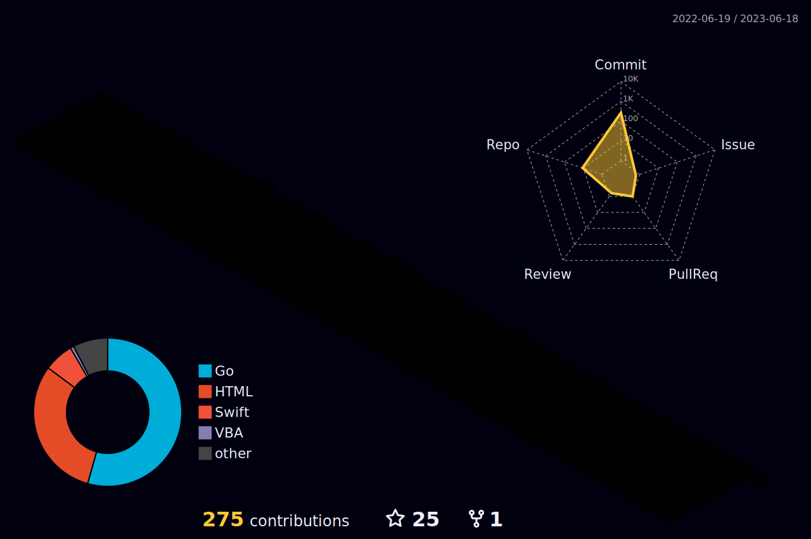

<!-- 

 -->

 

 ### Current Working Project - Nothing in progress
 Learning: [AI-For-Everyone](https://www.coursera.org/learn/ai-for-everyone/lecture/dLSWR/what-is-data)

### About Me
* I'm a passionate person in software development or any fields that interesed me.
* I like soving problem using programming language. Solving a problem can bring me happiness.
* I also like music, running, shopping, chatting with my friend ,watching movie and reading some interesing books.

### My Personal Website : [💖Jackson.tmm](https://ryantokmanmokmtm.github.io/)

### State 
<!--   -->
<!--  -->

<!-- <h3 align="left">Github-stats:</h3>

 -->
<!-- 

 -->

<h3 align="left">Projects:</h3>

**Real-time-communication Chat app:** 
[chat-app-swift](https://github.com/RyanTokManMokMTM/swiftui-chat-app) | 
[chat-server-golang](https://github.com/RyanTokManMokMTM/chat-app-server)

**Movie Social app:** 
[movie-app-swift](https://github.com/RyanTokManMokMTM/MovieAppSwiftUI) | 
[movie-server-golang](https://github.com/RyanTokManMokMTM/movie-server)

**Cinnox_backend_line_bot:**
[Cinnox_backend](https://github.com/RyanTokManMokMTM/cinnox_backend_hw)

**TMDB-webcrawler:**
[TMDB-movie-webcrawler](https://github.com/RyanTokManMokMTM/tmdb-movie-webcrawler)

**AES Alogrithmn(Course Project):**
[AES](https://github.com/RyanTokManMokMTM/AES)

**Simple Blog Service with gRPC:**
[Blog-Service-gRPC](https://github.com/RyanTokManMokMTM/gRPC-microservices-blogService)

**Dcard_demo_shortenurl(Frontend - ReactJS):**
[dcard_demo_shortenurl-frontend](https://github.com/RyanTokManMokMTM/dcard_demo_shortenurl)

**Dcard_demo_shortenurl(Backend - Golang):**
[dcard_demo_shortenurl-frontend](https://github.com/RyanTokManMokMTM/dcard_shorten_url_demo)

**NLP Simple Project(Course):**
[NLP](https://github.com/RyanTokManMokMTM/NLP_Final)

**React Simple Movie App:**
[React Movie](https://github.com/RyanTokManMokMTM/react-heroku)

**Movie Booking Service - NodeJS(Course Project):**
[Movie Booking Service](https://github.com/RyanTokManMokMTM/NodeJsServer)

**IOS Netflix Clone - Udemy Course**
[Netflix-Clone](https://github.com/RyanTokManMokMTM/Swift_IOS)

**Unreal Game - BullCowGame:**
[BullAndCow](https://github.com/RyanTokManMokMTM/Unreal)

**C game(Course Project - Year1):**
[C-game](https://github.com/RyanTokManMokMTM/C-_final_prpject)

<h3 align="left">Tech Stack:</h3>

  

    
       
 </a>   
<!--   -->
         

<!-- <a href="https://kubernetes.io" target="_blank" rel="noreferrer">  -->

<h3 align="left">Tools:</h3>

        

<h3 align="left">Connect with me:</h3>

